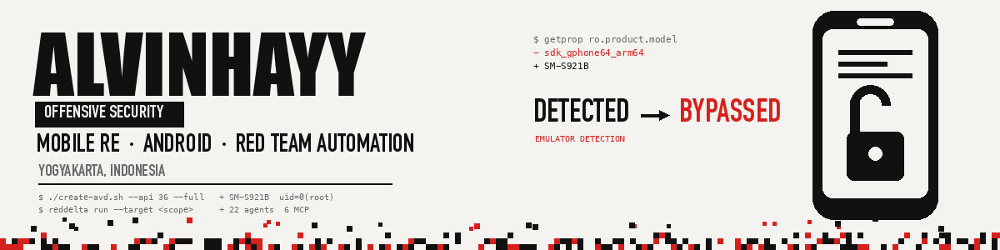

  
  
  
  

I take apart Android applications, and I automate the parts of offensive work
that should not need a human.

Most of my time goes to the awkward middle of mobile security — the part after
static analysis stops being useful and before you can actually reach the
application logic. Packers, RASP SDKs, emulator detection, TLS pinning, Flutter
apps that ignore the system trust store entirely.

The tooling here exists because I hit a wall and the existing write-ups were
wrong about why.

### Currently

- Reverse engineering Android apps — packers, RASP, Flutter/Dart AOT binaries
- Building multi-agent tooling for engagement work, with scope and phase gates
  rather than a model left to its own judgement
- Writing it down, including the approaches that **didn't** work

### Projects

| | |
|---|---|
| **[Mobile-Pentest-Setup](https://github.com/alvinhayy/Mobile-Pentest-Setup)** | Build an anti-detection rooted Android AVD in one command — KernelSU root, system-wide device identity spoofing, proxy CA into the APEX trust store |
| **RedDelta-TA416** `private` | AI red team orchestrator — 22 specialist agents over an isolated Kali execution plane, RAG-backed knowledge, persistent engagement state, and phase gates that stop for human approval before exploitation. SvelteKit control plane, Python MCP servers |
| **[URL-Status-Checker](https://github.com/alvinhayy/URL-Status-Checker)** | Bulk URL status checker for bug bounty recon |
| **[Scanning-Malware](https://github.com/alvinhayy/Scanning-Malware)** | Scan a directory against VirusTotal |
| **[MageR-Scripts](https://github.com/alvinhayy/MageR-Scripts)** | Small scripts for things I got tired of doing by hand |

### Writing

- [Building an Anti-Detection Rooted AVD (Android 16 + KernelSU)](https://blog.hayyvin.my.id/mobile-hacking-anti-detection-rooted-avd-kernelsu) — why `emulator -prop` cannot touch `ro.*`, why `skip_mount` silently voids `system.prop`, and why a CA has to be mounted into zygote
- [Bypass SSL Pinning with Frida & Objection](https://blog.hayyvin.my.id/mobile-hacking-bypass-ssl-android-ssl-pinning-with-frida-objection)
- [Install a Burp CA Certificate on Android 11](https://blog.hayyvin.my.id/mobile-hacking-install-burp-certificate)

More at **[blog.hayyvin.my.id](https://blog.hayyvin.my.id)** · HTB and CTF writeups at
**[writeup.hayyvin.my.id](https://writeup.hayyvin.my.id)**

### Working with

  
  
  
  
  
  
  
  
  
  
  

Yogyakarta, Indonesia · everything published here comes from systems I own or was authorised to test
